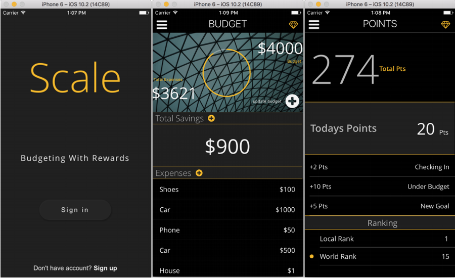

## 
Scale

***

Financial Independence Through Social Obligation

***

Scale aims to bring you financial freedom through habit forming social interactions. Putting your budget on paper, or in a basic spreadsheet is essential
 if you want a healthy financial future. Creating a detailed budget can help you reach your financial goals, whether you're saving for a car, buying a home
  or paying off student loans. By sticking to a budget, you can save thousands of dollars each year and avoid overspending.

Sticking to that budget is often the hard part. Scale streamlines the process of staying on top of your budget by allowing you to bring it with you, wherever
you go. Having your own customizable social network reinforces the drive to maintain your budget. Add friends and family to your network and allow them to see
your budgeting score, and also allow you to see theirs. If someone you follow hasn't updated in a certain period, you can let them know you see they aren't
proactive, and vice versa.

This project uses React Native as the frontend, and Firebase on the backend to co-develop iOS and Android versions.

ReadMe & [Wiki](https://github.com/CUNYTech/BudgetApp/wiki) are a WIP, change back often for updates.
